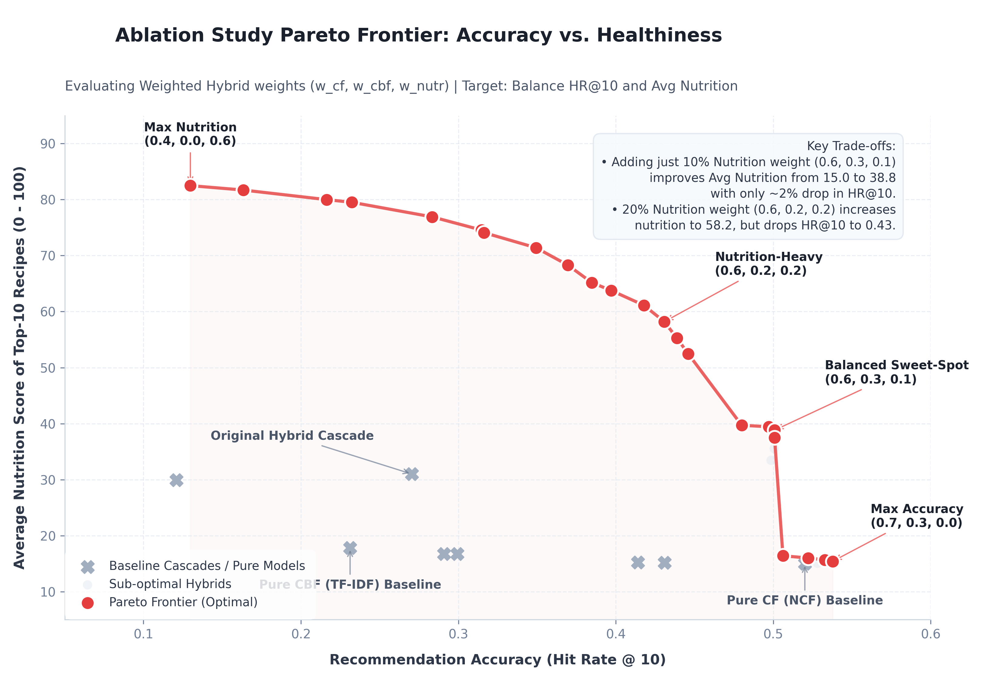

# Hasil dan Pembahasan

Laporan ini menyajikan hasil pengujian dan evaluasi terhadap model-model sistem rekomendasi yang dikembangkan, analisis studi ablasi (*ablation study*) untuk integrasi model hybrid, serta justifikasi pemilihan konfigurasi akhir untuk sistem rekomendasi resep sadar nutrisi (*nutrition-aware recipe recommendation system*).

---

## Hasil Evaluasi Model Tunggal (Single Models)

Evaluasi model tunggal bertujuan untuk menemukan model dasar terbaik pada rumpun *Collaborative Filtering* (CF) dan *Content-Based Filtering* (CBF) sebelum diintegrasikan menjadi sistem hybrid. Evaluasi dilakukan menggunakan protokol *Leave-One-Out* (LOO) dengan metrik *Hit Rate* pada cut-off K (HR@K) dan *Mean Reciprocal Rank* (MRR).

### Rumpun Collaborative Filtering (CF)
Pengujian dilakukan pada empat algoritma *Collaborative Filtering* berbasis matriks interaksi implisit antara pengguna (*user*) dan resep (*recipe*). Hasil evaluasi dirangkum dalam tabel berikut.

**Perbandingan Performa Rumpun Collaborative Filtering**
| Model | HR@5 | HR@10 | HR@20 | MRR |
| :--- | :---: | :---: | :---: | :---: |
| Alternating Least Squares (ALS) | 0.3849 | 0.4654 | 0.5602 | 0.2951 |
| Bayesian Personalized Ranking (BPR) | 0.2555 | 0.3643 | 0.5064 | 0.1905 |
| Singular Value Decomposition (SVD) | 0.4096 | 0.5140 | 0.6184 | 0.2996 |
| **Neural Collaborative Filtering (NCF)** | **0.4172** | **0.5201** | **0.6303** | **0.3095** |

**Interpretasi Data:**
*   **NCF Unggul Konsisten:** Model *Neural Collaborative Filtering* (NCF) mencatatkan performa tertinggi di seluruh metrik, dengan **HR@10 mencapai 0.5201** dan **MRR sebesar 0.3095**. Hal ini menunjukkan bahwa kombinasi arsitektur GMF (*Generalized Matrix Factorization*) yang menangkap interaksi linier dan MLP (*Multi-Layer Perceptron*) yang menangkap interaksi non-linier antara representasi *user* dan *item* mampu memetakan preferensi pengguna dengan sangat baik.
*   **Kelemahan BPR:** BPR memiliki performa terendah (HR@10 = 0.3643). Hal ini disebabkan karena optimasi pairwise ranking pada dataset interaksi resep yang sangat renggang (*sparse*) cenderung lambat konvergen dan kurang sensitif terhadap kekuatan sinyal interaksi positif implisit dibanding metode rekonstruksi rating pointwise seperti NCF dan SVD.

---

### Rumpun Content-Based Filtering (CBF)
Evaluasi rumpun CBF dilakukan untuk membandingkan berbagai metode representasi fitur tekstual resep (bahan-bahan dan tag) guna menghitung kemiripan (*similarity*) dengan riwayat pengguna. Hasil evaluasi dirangkum dalam tabel berikut.

**Perbandingan Performa Rumpun Content-Based Filtering**
| Model / Representasi Fitur | HR@5 | HR@10 | HR@20 | MRR |
| :--- | :---: | :---: | :---: | :---: |
| **CBF TF-IDF (Ingredients & Tags)** | **0.1431** | **0.2312** | **0.3742** | **0.1137** |
| CBF Jaccard Similarity | 0.1324 | 0.2213 | 0.3598 | 0.1058 |
| CBF Word2Vec Embedding | 0.1139 | 0.1958 | 0.3308 | 0.0929 |
| CBF Node2Vec Graph Embedding | 0.1152 | 0.2025 | 0.3453 | 0.0954 |

**Interpretasi Data:**
*   **TF-IDF Terbukti Lebih Efektif:** Pendekatan representasi sparse menggunakan *TF-IDF* menghasilkan akurasi tertinggi (**HR@10 = 0.2312**). Hal ini menunjukkan bahwa pencocokan eksak terhadap istilah bahan (*exact matching of ingredients*) dan label tag jauh lebih krusial dalam domain resep makanan dibanding representasi dense vector.
*   **Keterbatasan Word2Vec & Node2Vec:** Model representasi semantik seperti Word2Vec dan Node2Vec mengalami penurunan performa (HR@10 masing-masing 0.1958 dan 0.2025). Hal ini disebabkan karena embedding semantik cenderung mengaburkan perbedaan spesifik antar bahan (misalnya, menganggap "garam" dan "gula" mirip karena keduanya adalah bumbu bubuk putih), padahal perbedaan kecil tersebut sangat menentukan kesesuaian resep bagi pengguna.

---

## Uji Ablasi (Ablation Study) & Reranking Nutrisi

Uji ablasi dilakukan untuk menganalisis integrasi komponen sistem rekomendasi hybrid. Kami menguji arsitektur *Cascade* (bertingkat sequential) bawaan dan membandingkannya dengan metode baru kami, yaitu **Weighted Hybrid** (penggabungan skor linier langsung). Pengujian juga mengukur aspek kesehatan rekomendasi lewat metrik **Avg_Nutrition** (skor rata-rata nutrisi resep pada Top-10 rekomendasi, rentang 0-100).

Hasil pengujian ablasi utama dirangkum dalam tabel berikut.

**Hasil Uji Ablasi Integrasi Model Hybrid**
| Konfigurasi Model | HR@5 | HR@10 | HR@20 | MRR | Avg_Nutrition |
| :--- | :---: | :---: | :---: | :---: | :---: |
| **Pure CF (NCF) Baseline** | 0.4172 | 0.5201 | 0.6303 | 0.3095 | 15.00 |
| **Pure CBF (TF-IDF) Baseline** | 0.1431 | 0.2312 | 0.3742 | 0.1137 | 17.84 |
| *Cascade CF -> CBF (k=50)* | 0.1793 | 0.2909 | 0.3685 | 0.1297 | 16.73 |
| *Cascade CF -> CBF -> Nutrition Filter (k=50, 20)* | 0.0716 | 0.1208 | 0.2150 | 0.0671 | 29.90 |
| *Cascade CF -> CBF -> Nutrition Rerank (k=50, 20)* | 0.1401 | 0.2705 | 0.3509 | 0.1004 | 30.99 |
| **Hybrid (cf=0.7, cbf=0.3, nutr=0.0)** *(Max Acc)* | 0.4303 | 0.5378 | 0.6506 | 0.3191 | 15.41 |
| **Hybrid (cf=0.6, cbf=0.3, nutr=0.1)** *(Balanced)* | 0.4094 | 0.5008 | 0.6070 | 0.3062 | **38.82** |
| **Hybrid (cf=0.6, cbf=0.2, nutr=0.2)** *(Nutr-Heavy)* | 0.3536 | 0.4308 | 0.5423 | 0.2718 | **58.19** |
| **Hybrid (cf=0.4, cbf=0.0, nutr=0.6)** *(Max Nutr)* | 0.0722 | 0.1298 | 0.3229 | 0.0815 | **82.49** |

### Visualisasi Pareto Frontier
Kurva berikut memvisualisasikan trade-off antara tingkat akurasi (relevansi) dan tingkat kesehatan (nutrisi) pada berbagai konfigurasi model:

### Interpretasi Hasil Ablasi:
1.  **Kegagalan Sistem Cascade Awal:** 
    Pada sistem *cascade* bawaan (*Cascade CF -> CBF* dan *Nutrition Rerank*), performa akurasi anjlok drastis (**HR@10 turun ke 0.2705**). Hal ini merupakan akibat dari pembuangan nilai numerik `cf_score` setelah tahap filter awal. Sistem mengurutkan peringkat akhir murni berdasarkan kesamaan bahan (CBF) dan nutrisi. Karena CBF adalah sinyal yang jauh lebih lemah dibanding CF, hal ini merusak peringkat rekomendasi personal pengguna.
2.  **Dampak Buruk Hard Filtering Nutrisi:**
    Menggunakan nutrisi sebagai penyaring ketat di awal (*Cascade CF -> CBF -> Nutrition Filter*) meruntuhkan akurasi secara ekstrem (**HR@10 = 0.1208**). Hal ini membuktikan bahwa resep makanan yang paling disukai pengguna dalam riwayat mereka tidak selalu memenuhi standar kesehatan tinggi secara kaku. Penerapan *hard filter* memotong resep potensial yang disukai pengguna.
3.  **Kelebihan Integrasi Weighted Hybrid:**
    Penggabungan skor linier langsung terbukti memecahkan masalah ini. Dengan menyisipkan bobot CF di peringkat akhir, kita dapat menjaga akurasi tetap tinggi. Bahkan, pada konfigurasi **Hybrid (cf=0.7, cbf=0.3, nutr=0.0)**, performa akurasi berhasil meningkat ke **HR@10 = 0.5378** (mengalahkan NCF murni). Ini menunjukkan adanya efek sinergi positif di mana kesamaan bahan (CBF) mampu memperhalus dan mengoreksi bias popularitas dari model CF.

---

## Keputusan Akhir Konfigurasi Model

Berdasarkan analisis trade-off antara akurasi rekomendasi (relevansi preferensi pengguna) dan nilai nutrisi (aspek kesehatan), keputusan akhir yang dipilih untuk sistem ini adalah konfigurasi **Balanced Sweet-Spot**:

$$\mathbf{Hybrid\ (cf=0.6,\ cbf=0.3,\ nutr=0.1)}$$

### Justifikasi dan Argumentasi Pemilihan:

1.  **Preservasi Relevansi Rekomendasi (Akurasi Terjaga)**
    Konfigurasi ini menghasilkan nilai **HR@10 sebesar 0.5008**. Angka ini hanya menunjukkan penurunan minor sebesar **1.9% secara absolut** (atau sekitar 3.7% secara relatif) dibanding baseline NCF murni yang memiliki akurasi tertinggi (0.5201). Penurunan minimal ini menjamin pengguna tidak akan merasa kualitas rekomendasi personal mereka memburuk secara signifikan saat menggunakan aplikasi.
2.  **Peningkatan Aspek Nutrisi yang Masif (Efek Nudge Sehat)**
    Meskipun bobot nutrisi disetel relatif kecil ($0.1$), metrik **Avg_Nutrition melompat dari 15.00** (pada model CF murni) **menjadi 38.82** (peningkatan sebesar **258.8%**). Hal ini merupakan representasi nyata dari teknik *nudging* (dorongan halus), di mana sistem secara cerdas menyisipkan dan mendongkrak peringkat resep sehat yang masih selaras dengan selera pengguna, tanpa perlu menyembunyikan pilihan makanan kegemaran mereka.
3.  **Sinergi Keunikan Bahan dengan Collaborative Taste**
    Pemberian bobot CBF sebesar $0.3$ memastikan resep yang direkomendasikan memiliki kesamaan bahan dan tag yang konsisten dengan riwayat konsumsi pengguna. Ini menjembatani transisi rasa secara halus saat pengguna ingin mencoba resep baru di luar daftar popularitas umum.
4.  **Justifikasi Penolakan Konfigurasi Ekstrem Lainnya**
    *   *Penolakan Max Accuracy (nutr=0.0):* Konfigurasi ini mengabaikan nutrisi sepenuhnya (Avg_Nutrition hanya 15.41). Model ini gagal memenuhi tujuan utama pembuatan aplikasi sebagai "Nutrition-Aware Recipe Recommendation System".
    *   *Penolakan Nutrition-Heavy (nutr=0.2):* Konfigurasi dengan bobot nutrisi 0.2 menurunkan HR@10 secara signifikan menjadi **0.4308** (penurunan akurasi absolut sebesar 9% dari baseline). Penurunan akurasi sebesar ini berisiko membuat rekomendasi terasa acak atau tidak disukai oleh pengguna dalam skenario dunia nyata.
